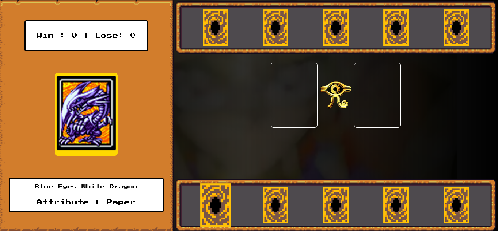

# Jogo de Cartas Yu-Gi-Oh! estilo Jokenpo

## :rocket: Descrição do projeto

Jogo de cartas jokenpo baseado no Yu Gi Oh!. Este projeto faz parte do desafio de código da [DIO](https://dio.me).

## :speech_balloon: Conheça mais dos meus projetos

Me adicione no Linkedin :point_right: [Leonardo Abdala](https://www.linkedin.com/in/leonardo-abdala/) e no Github, vamos desenvolver juntos. :facepunch:
